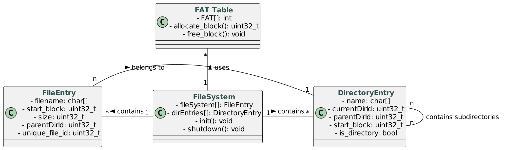
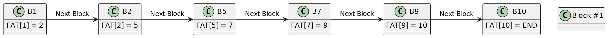
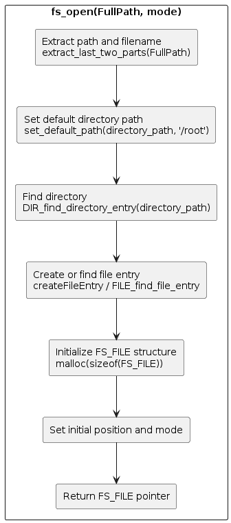
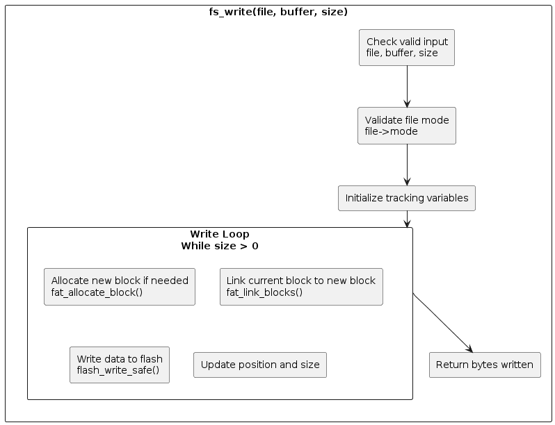
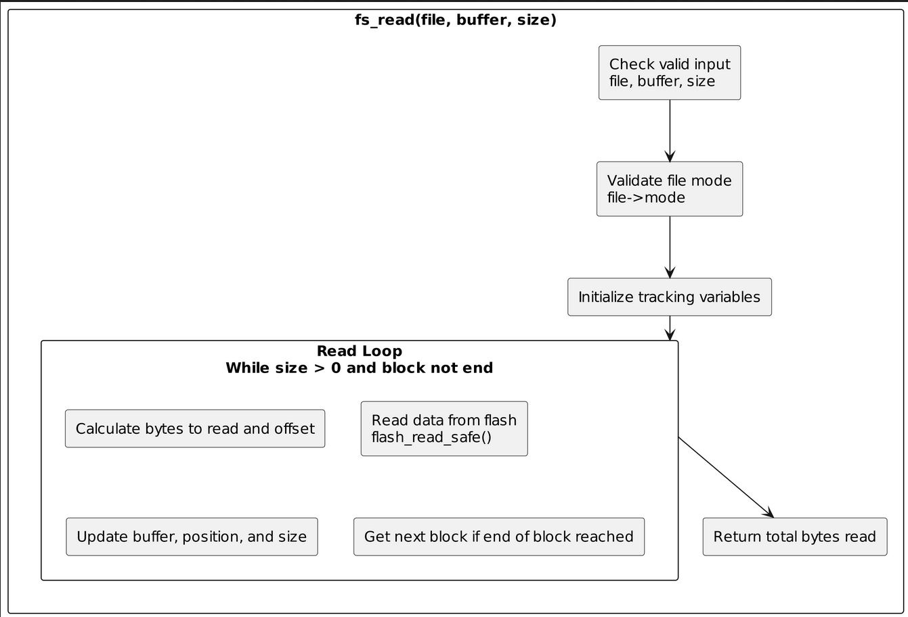
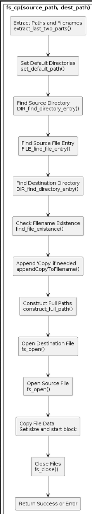

# Simple Filesystem for Raspberry Pi Pico

 # Table of Contents

1. [Introduction](#introduction)
2. [Key Features](#key-features)
3. [Objective](#objective)
4. [Getting Started](#getting-started)
   - [Prerequisites](#prerequisites)
   - [Installation](#installation)
5. [Filesystem Architecture Overview](#filesystem-architecture-overview)
   - [Introduction](#introduction-1)
   - [Components](#components)
     - [File Allocation Table (FAT)](#file-allocation-table-fat)
     - [Structured Data](#structured-data)
     - [Storage Strategy](#storage-strategy)
   - [Operational Design](#operational-design)
     - [Key Functionalities](#key-functionalities)
   - [Advanced Considerations](#advanced-considerations)
     - [Future-Proofing](#future-proofing)
     - [Complexity vs. Simplification](#complexity-vs-simplification)
     - [System Flexibility](#system-flexibility)
   - [Current Limitations and Future Directions](#current-limitations-and-future-directions)
6. [Detailed Structure and Interconnectivity of the Filesystem Components](#detailed-structure-and-interconnectivity-of-the-filesystem-components)
   - [Overview](#overview-1)
   - [Structures Explained](#structures-explained)
     - [`flash_data`](#flash_data)
     - [`DirectoryEntry`](#directoryentry)
     - [`FileEntry`](#fileentry)
     - [`FS_FILE`](#fs_file)
   - [Interconnectivity Explained](#interconnectivity-explained)
     - [From `flash_data` to `FileEntry` and `DirectoryEntry`](#from-flash_data-to-fileentry-and-directoryentry)
     - [DirectoryEntry and FileEntry Interaction](#directoryentry-and-fileentry-interaction)
     - [Utilization of `FS_FILE`](#utilization-of-fs_file)
   - [Conclusion](#conclusion-1)
   - [Diagram](#diagram)
7. [Understanding the File Allocation Table (FAT) in Embedded Systems](#understanding-the-file-allocation-table-fat-in-embedded-systems)
   - [Overview](#overview-2)
   - [Architecture of FAT](#architecture-of-fat)
   - [Key Functionalities](#key-functionalities-1)
   - [Dynamic Allocation and Thread Safety](#dynamic-allocation-and-thread-safety)
   - [Example](#example)
   - [Error Handling](#error-handling)
   - [Conclusion](#conclusion-2)
8. [`fs_open` Function](#fs_open-function)
9. [`fs_write` Function](#fs_write-function)
10. [`fs_read` Function](#fs_read-function)
11. [`fs_cp` Function](#fs_cp-function)


## Introduction


Welcome to the filesystem designed specifically for the Raspberry Pi Pico. This filesystem integrates a linked File Allocation Table (FAT) with a robust directory and file management system to facilitate dynamic page allocation and efficient memory usage.

## Key Features

- **Dynamic Memory Allocation:** Utilizes a linked FAT system that optimizes the allocation of storage pages, ensuring that the available memory is used efficiently and effectively.
- **Structured File and Directory Management:** Employs structured data handling through file entries (`FileEntry`) and directory entries (`DirectoryEntry`) to manage files and directories systematically. This structure not only simplifies data management but also enhances system performance.
- **Designed for Expansion:** The filesystem is organized into directories and subdirectories within the codebase, promoting clarity and making it easier to navigate and expand for future development.
- **Memory Efficiency:** Significant attention has been devoted to creating a memory-efficient filesystem. By leveraging metadata and structured system components, the filesystem is tailored to meet the stringent memory constraints of microcontroller environments like that of the Pi Pico.
- **Comprehensive Environment:** Provides a full-featured development environment that supports various filesystem operations such as reading, writing, moving, and deleting files and directories efficiently.

## Objective

The primary goal of this filesystem is to offer a scalable, efficient, and easy-to-manage system that aligns with the needs of embedded systems developers. By focusing on efficient memory use and system integrity, the filesystem serves as a practical example of how advanced data management techniques can be implemented on constrained devices like the Pi Pico.

In designing this filesystem, we aimed to lay a foundation that not only addresses current data management needs but also provides a platform for future enhancements. Whether for educational purposes, real-world applications, or ongoing development projects, this filesystem is crafted to foster an understanding and implementation of core filesystem concepts in embedded systems.


## Getting Started

### Prerequisites

What things you need to install the software and how to install them, for example:

```bash
sudo apt-get install cmake gcc-arm-none-eabi libnewlib-arm-none-eabi
```

### Installation

A step-by-step series of instructions that tell you how to get a development environment running.

```bash 
https://gitlab.uwe.ac.uk/a2-imeri/cap_fs.git
cd cap_fs
mkdir build
cd build
cmake ..
make 
```

# Filesystem Architecture Overview

## Introduction
This document provides an in-depth look at the architecture of a dynamic, efficient filesystem designed to fully utilize available flash memory while managing files and directories effectively. The architecture integrates a File Allocation Table (FAT) with structured file and directory management techniques to optimize performance and scalability.

## Components

### File Allocation Table (FAT)
- The FAT is a core component, designed for dynamic memory efficiency. It uses pointers to link blocks, enabling a flexible approach to memory management that maximizes the utilization of available flash memory.

### Structured Data
- **FileEntry Structure:**
  - `start_block`: Represents the first block where the file starts, but not necessarily where the file's metadata is located due to updates.
  - `parentDirId`: Links a file to its parent directory for easier tracking and location within the filesystem.

- **Directory Structure:**
  - `currentDirId` and `parentDirId`: Support hierarchical structuring of directories, facilitating complex directory trees.

### Storage Strategy
- Designated storage locations in flash for files, directories, and the FAT optimize read/write speeds and reduce operational cycles. This strategic placement ensures quick system startups and efficient access patterns.

## Operational Design

### Key Functionalities
- **Efficient Shutdown Process:**
  - Integrates comprehensive save functions (`saveFileEntriesToFileSystem`, `saveDirectoriesEntriesToFileSystem`, `saveFATEntriesToFileSystem`) to ensure all data is persistently stored before shutdown, preserving data integrity.

- **Enhanced File Operations:**
  - Tailored operations for flash memory management include optimized algorithms for reading, writing, and erasing, considering the minimal sector size of 4096 bytes, simplifying operations and enhancing flexibility.

## Advanced Considerations

### Future-Proofing
- The architecture supports future expansion and dynamic operations like wireless data transfer and on-the-fly file generation, pointing towards a system that evolves with technological advancements and user needs.

### Complexity vs. Simplification
- While the system simplifies user interactions, it handles complex backend processes to ensure robust operations. For instance, moving a file between directories involves merely changing its `parentDirId`, but this simple action triggers a series of validation checks and structural updates to maintain system integrity.

### System Flexibility
- Supports the presence of files with identical names in different directories, enhancing organizational flexibility. Changes like these reflect a deliberate move towards a more adaptable and resilient system architecture.

## Current Limitations and Future Directions

#### Challenges:
1. **Data Recovery:**
   - There is no current mechanism to recover data in case of corruption, highlighting a potential area for future development.

2. **System Capacity:**
   - The finite nature of the available memory imposes limits on the number of files and directories that can be actively managed.

3. **Wear-Leveling:**
   - The FAT does not currently prioritize blocks based on write frequency, which could be improved with algorithms that detect and manage wear leveling more effectively.

4. **Memory Constraints:**
   - The limited RAM impacts the ability to maintain large arrays or handle extensive data operations within memory.

5. **File and Directory Management Complexity:**
   - As the filesystem evolves, maintaining a balance between user simplicity and backend complexity will be crucial. The design must continue to evolve to handle increased flexibility without overwhelming system resources.

## Conclusion
The detailed architecture outlined here establishes a solid foundation for managing files and directories efficiently on devices like the Raspberry Pi Pico. This system not only meets current data management needs but also sets the stage for future enhancements that could include more sophisticated data recovery processes and improved wear leveling. As development continues, the balance between complexity for the user and operational integrity will remain a priority, ensuring the filesystem remains both powerful and user-friendly.


## Detailed Structure and Interconnectivity of the Filesystem Components

### Overview

The filesystem designed for the Raspberry Pi Pico incorporates several key structures (`flash_data`, `DirectoryEntry`, `FileEntry`, `FS_FILE`) that together provide a robust framework for file and directory management. Below, we explore each of these structures in detail, their roles within the filesystem, and how they interconnect to create an efficient and manageable system.

### Structures Explained

#### `flash_data`

- **Purpose:** This structure is pivotal for enhancing the reliability and integrity of the data stored in flash memory. It is particularly crucial in systems where data integrity and wear leveling are significant concerns.
- **Components:**
  - `valid`: A boolean flag that indicates whether the data stored in flash is valid, helping in integrity checks and error handling.
  - `write_count`: Maintains a count of how many times data has been written into a specific section of flash memory, aiding in wear leveling strategies.
  - `data_len`: Specifies the length of the actual data stored, in bytes, which is critical for read/write operations.
  - `data_ptr`: A pointer to the actual data, facilitating direct access to the stored content in flash memory.


```c
typedef struct {
    bool valid;             // Indicates if the data is considered valid.
    uint32_t write_count;   // Tracks the number of times the data has been written to ensure wear leveling.
    size_t data_len;        // Specifies the length of the data in bytes.
    uint8_t *data_ptr;      // Points to the actual data stored in flash.
} flash_data;

```

## DirectoryEntry

- **Purpose:** Represents both files and directories within the filesystem, acting as nodes in the filesystem's hierarchical structure.
- **Components:**
  - `name`: The name of the file or directory.
  - `parentDirId`: The identifier of the parent directory, which helps in navigating the filesystem hierarchy.
  - `currentDirId`: For directories, this ID helps in maintaining the structure of nested directories.
  - `is_directory`: A boolean indicating whether the entry is a directory, which influences how the filesystem treats the entry (either as a container for other files/directories or as a single file).
  - `size`: For directories, this indicates the number of entries contained within. For files, it represents the file size.
  - `start_block`: The starting block in flash memory where the directory or file's data begins.
  - `in_use`: A boolean flag indicating whether the directory or file is actively used.


```c
typedef struct {
    char name[256];       // Name of the file or directory
    uint32_t parentDirId;    // ID of the parent directory
    uint32_t currentDirId; 
    bool is_directory;    // Flag to indicate if this is a directory
    uint32_t size;        // number of entries (for directories)
    uint32_t start_block; // Start block in flash memory
    bool in_use;  
} DirectoryEntry;

```


## FileEntry

- **Purpose:** Manages file metadata and supports the filesystem in tracking each file.
- **Components:**
  - `filename`: Stores the file's name or path, which is used for file identification and access.
  - `parentDirId`: Links the file to its parent directory for hierarchical structure support.
  - `size`: Represents the total size of the file, essential for read/write operations.
  - `in_use`: Indicates whether the file entry is currently in use, which helps in resource management.
  - `start_block`: Identifies the start of the file's data in flash memory, crucial for data retrieval.
  - `unique_file_id`: A unique identifier for each file, enhancing file tracking and management.

```c
// File entry structure
typedef struct {
    char filename[256];     // Path of the file
    uint32_t parentDirId;   // ID of the parent directory
    uint32_t size;      // Size of the file
    bool in_use;        // Indicates if this file entry is in use
    uint32_t start_block; // Offset in flash memory where the file data starts
    bool is_directory;      // Flag to indicate if this entry is a
    // uint8_t buffer[256];
    uint32_t unique_file_id; 
} FileEntry;

```


## FS_FILE

- **Purpose:** Acts as a file handle during file operations, linking the logical file operations to their physical data stored in flash memory.
- **Components:**
  - `entry`: A pointer to the FileEntry associated with the open file, enabling direct manipulation and access to file metadata.
  - `position`: Tracks the current position within the file, crucial for read and write operations.
  - `mode`: Indicates the file access mode (e.g., read, write), dictating how file operations are handled.


```c
typedef struct {
    FileEntry *entry;   // Pointer to the file entry in the file system
    uint32_t position;  // Current position in the file
    // FileMode mode; 
    char mode;
} FS_FILE;
```


## Interconnectivity Explained

### From `flash_data` to `FileEntry` and `DirectoryEntry`:

`flash_data` provides a foundational mechanism for managing the physical storage of files (`FileEntry`) and directories (`DirectoryEntry`). It ensures that data integrity and wear leveling are maintained, which is vital for the longevity and reliability of the filesystem.

### DirectoryEntry and FileEntry Interaction:

`DirectoryEntry` structures can contain multiple `FileEntry` structures by linking through `parentDirId` and `currentDirId`, forming a tree-like hierarchy. This setup allows the filesystem to represent complex directory structures and manage files efficiently within those directories.

### Utilization of `FS_FILE`:

`FS_FILE` serves as a bridge between the user's file operations and the filesystem's data management routines. It uses the metadata stored in `FileEntry` to facilitate file manipulation such as reading, writing, and seeking within the file.

## Conclusion

The combination of these structures creates a robust filesystem that is capable of handling various data management tasks efficiently. This design not only supports basic file operations but also enhances the system's ability to manage data integrity, storage efficiency, and hierarchical data organization. By understanding how these components interact, users and developers can better utilize the filesystem and potentially extend its capabilities to suit more complex applications.

## Diagram



<br><br><br>

## Understanding the File Allocation Table (FAT) in Embedded Systems

### Overview

The File Allocation Table (FAT) is a crucial component of the filesystem implemented for the Raspberry Pi Pico. It plays a pivotal role in managing how data blocks are utilized and tracked within the filesystem's storage space. This segment provides a detailed exploration of how FAT works within this context, explaining its structure, functionalities, and how it interacts with other components of the filesystem.

### Architecture of FAT

The FAT system is essentially an array (`FAT[TOTAL_BLOCKS]`) where each element of the array represents a block in the flash storage. The value stored in each element of this array indicates the status of the block—whether it is free, reserved, in use, or a marker of the end of a file chain.

#### Block Status Indicators:

- `FAT_ENTRY_FREE`: Indicates that the block is available for use.
- `FAT_ENTRY_RESERVED`: Marks the block as reserved for system use or bad blocks.
- `FAT_ENTRY_END`: Signifies the end of a file's block chain.
- `FAT_NO_FREE_BLOCKS`: Used when no free blocks are available for allocation.

### Key Functionalities

#### Initialization (`fat_init`):

Initializes the FAT, setting all blocks to free except for those reserved for system use. This is done to prepare the filesystem for data storage and retrieval operations.

#### Block Allocation (`fat_allocate_block`):

Allocates a free block for file storage. It searches through the FAT to find a free block, marks it as the end of a file chain (if it's the last block being used in that file), and returns the block number.

#### Block Freeing (`fat_free_block`):

Frees a block when it is no longer needed, setting its status back to `FAT_ENTRY_FREE`, thus making it available for future allocations.

#### Block Linking (`fat_link_blocks`):

Manages the chaining of blocks to accommodate file data that spans multiple blocks. This function sets the `nextBlock` as the continuation of `prevBlock` in the FAT, facilitating file integrity and continuity.

#### Next Block Retrieval (`fat_get_next_block`):

Retrieves the next block in a file's chain, enabling sequential file access and simplifying the process of reading files that span multiple blocks.

### Dynamic Allocation and Thread Safety

The FAT management system is designed to be both dynamic and thread-safe:

- **Dynamic Allocation:** The allocation strategies prioritize placing new blocks near related blocks (hint blocks) to reduce fragmentation and improve access speeds.
- **Thread Safety:** Mutex-based synchronization is employed to ensure that operations on the FAT (like block allocation and linking) are safe from concurrent access issues, which is crucial in a multitasking environment like that of the Raspberry Pi Pico.


### Example 


#### Explanation

- **Horizontal Layout:** Represents the sequence of blocks as they are linked in the file's data chain.
- **Blocks:** Each "Block #x" represents a physical block in the filesystem. The annotation beside each block shows the block number to which it points next in the FAT.
- **Arrows:** Each arrow from one block to another indicates the logical flow of data, showing how a file might span multiple non-contiguous blocks.
- **End Marker:** The last block in a file's chain points to "END", indicating there are no more blocks in this file's data chain.

This structure enables the filesystem to efficiently manage space by allowing files to occupy scattered blocks on the disk, thereby optimizing the usage of available storage space and simplifying file expansion and deletion processes.


### Error Handling

Robust error handling mechanisms are integral to the FAT system. These mechanisms handle various scenarios such as attempts to free reserved or invalid blocks, attempts to allocate when no blocks are available, and handling of unexpected entries in the FAT during block retrieval.

### Conclusion

The FAT plays an essential role in the filesystem architecture, providing a reliable method for tracking and managing the physical blocks where data is stored. Its implementation ensures that the filesystem can operate efficiently and reliably, even in the constrained environment of embedded systems like the Raspberry Pi Pico. By integrating dynamic allocation, thread safety, and comprehensive error handling, the FAT system balances performance and simplicity, making it suitable for a wide range of applications on embedded platforms.


## fs_open Function

The `fs_open` function is designed to open a file located by `FullPath` in the specified mode (`'r'` for read, `'w'` for write, `'a'` for append). Here’s how the function operates, along with a brief explanation of each step:

1. **Extract Path and Filename:** The function begins by calling `extract_last_two_parts` to split the full path into its directory and filename components. This separation is crucial for locating the file within the correct directory.

2. **Set Default Directory Path:** If the directory path isn't specified explicitly in the path, the function sets it to `"/root"` using `set_default_path`. This ensures that there's always a valid directory context.

3. **Find Directory:** Utilizes `DIR_find_directory_entry` to locate the directory in the filesystem where the file should exist or be created. If the directory is not found, it outputs an error and exits.

4. **Create or Find File Entry:** Depending on the mode:
    - For `'w'` (write), it might create a new file entry using `createFileEntry`.
    - For `'r'` (read) or `'a'` (append), it looks for an existing file with `FILE_find_file_entry`.

5. **Initialize FS_FILE Structure:** Allocates memory for a new `FS_FILE` structure, which will hold the file descriptor.

6. **Set Initial Position and Mode:** The position within the file is set based on the mode—0 for new files or read mode, and the end of the file for append mode. The mode is also stored as a character within the `FS_FILE` structure.

7. **Return FS_FILE Pointer:** Finally, the newly created `FS_FILE` pointer is returned. If any step fails (such as directory not found or memory allocation failure), the function returns NULL.

This function effectively encapsulates the process of file opening in an embedded system like Raspberry Pi Pico, dealing with both file creation and opening for reading or appending in a streamlined manner that manages filesystem complexities behind the scenes.





## fs_write Function

The `fs_write` function is designed to write data from a buffer to a file opened in write (`'w'`) or append (`'a'`) mode. Here’s how the function operates, with a step-by-step explanation:

1. **Check Valid Input:** Initially, the function verifies that the file, buffer, and size parameters are valid. If any parameter is invalid (e.g., NULL pointers, negative size), it returns -1 to indicate an error.

2. **Validate File Mode:** It checks if the file is opened in a mode that allows writing (`'w'` or `'a'`). If not, it prints an error and exits, returning -1.

3. **Initialize Tracking Variables:** The function sets up necessary variables to track the current block, position within the block, and other states essential for managing the file writing process.

4. **Write Loop:** This is the core of the function where data is written to the filesystem:
    - **Allocate New Block:** If needed (i.e., at the end of the current block or if the current block is the end marker of the file), it allocates a new block using `fat_allocate_block`. If no blocks are available, it terminates the write operation with an error.
    - **Link Current Block to New Block:** Once a new block is allocated, it links the current block to the new block using `fat_link_blocks`, ensuring that the file data can continue into another block.
    - **Write Data to Flash:** Writes the current portion of the buffer to flash memory at the calculated offset using `flash_write_safe`.
    - **Update Position and Size:** Updates the file’s position and the remaining size to be written, preparing for the next iteration of the loop or the end of the write operation.

5. **Return Bytes Written:** After completing the write operations, the function returns the total number of bytes successfully written to the file.

This function handles multiple critical tasks such as managing the allocation and linkage of storage blocks in the filesystem, ensuring data is written to the correct location in flash memory, and updating file metadata accordingly. This structured approach is necessary to handle the complexities of file writing in an embedded environment where resources are limited and efficiency is paramount.





## fs_read Function

The `fs_read` function retrieves data from a file stored in flash memory, placing the retrieved data into a buffer provided by the caller. The steps and mechanisms involved are as follows:

1. **Check Valid Input:** The function first ensures that the file, buffer, and size parameters are valid. It checks for null pointers and ensures that the size is positive, returning -1 if any parameter is invalid.

2. **Validate File Mode:** It confirms that the file is opened in a readable mode, either `'read' ('r')` or `'append' ('a')`, as appending may also involve reading. If the mode is not appropriate, it returns -1.

3. **Initialize Tracking Variables:** Variables to track the current block from which data is being read, the position within that block, and the total number of bytes read are initialized.

4. **Read Loop:** The core of the function, where data is read from the file:
    - **Calculate Bytes to Read and Offset:** It calculates how many bytes to read in the current iteration (limited by the end of the current block or the requested size) and the offset in flash memory where the data starts.
    - **Read Data from Flash:** Uses `flash_read_safe()` to read data from flash memory into the buffer.
    - **Update Buffer, Position, and Size:** Updates the pointers and counters for the buffer, the total bytes read, and the remaining size to read.
    - **Get Next Block if End of Block Reached:** If the end of the current block is reached and there are more bytes to read, it retrieves the next block index from the FAT. If no more blocks are available or an error occurs, it exits the loop.

5. **Return Total Bytes Read:** After the loop completes, either through reading the requested number of bytes or encountering the end of the file chain, the total number of bytes read is returned.

This function effectively handles reading from potentially non-contiguous blocks by managing the FAT block chains, ensuring data integrity even with fragmented file storage. The use of mutexes (not shown in the function but implied for systems with concurrency) ensures thread-safe operations when accessing shared data structures like the FAT or flash memory.





## fs_cp Function

The `fs_cp` function is designed to copy a file from a source path to a destination path without overwriting existing files at the destination, appending "Copy" to the filename if necessary. Here's how it operates step-by-step:

1. **Extract Paths and Filenames:** It starts by extracting the directory and filename components from both the source and destination paths using the `extract_last_two_parts` function.

2. **Set Default Directories:** If no specific directory is provided in the paths, the function sets default directory paths to `"/root"`.

3. **Find Source Directory:** The function searches for the directory entry corresponding to the source path using `DIR_find_directory_entry`. If the directory does not exist, it returns an error.

4. **Find Source File Entry:** It then looks for the file entry within the source directory. If the file is not found, it returns an error.

5. **Find Destination Directory:** Similar to the source, it searches for the destination directory. If not found, it returns an error.

6. **Check Filename Existence:** It checks if a file with the same name already exists in the destination directory.

7. **Append 'Copy' if needed:** If a file with the same name exists, it appends "Copy" to the filename to avoid overwriting. If a filename with "Copy" also exists, it returns an error.

8. **Construct Full Paths:** Constructs full paths for both the source and destination files using the `construct_full_path` function.

9. **Open Destination File:** Opens or creates the destination file with write permissions using `fs_open`.

10. **Open Source File:** Opens the source file with read permissions.

11. **Copy File Data:** Sets the size and start block of the destination file to match those of the source file, effectively copying the file data.

12. **Close Files:** Closes both the source and destination file handles.

13. **Return Success or Error:** Finally, returns 0 on successful copying or -1 on any error encountered during the process.





 
